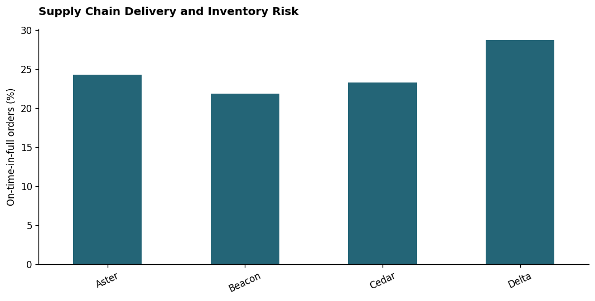
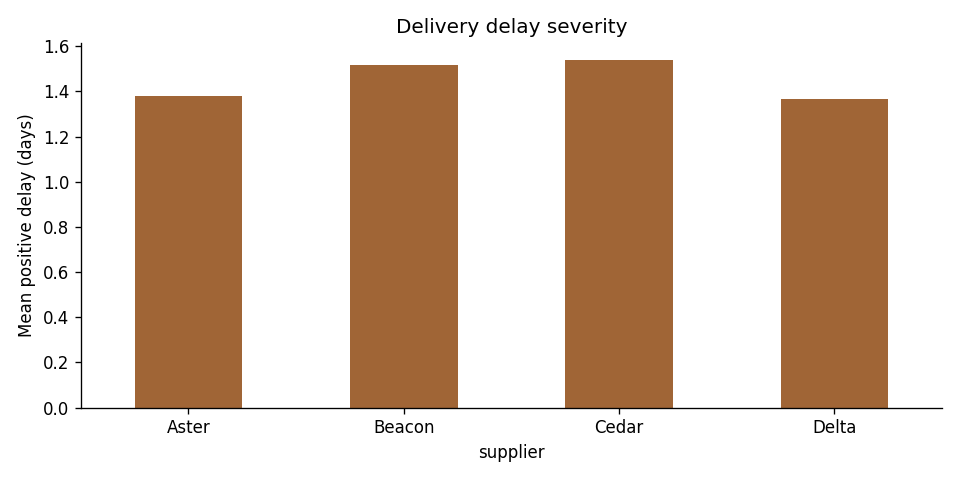

# Supply Chain Delivery and Inventory Risk

Which suppliers miss delivery commitments?

## Overview

A distributor needs to prioritize supplier discussions using comparable delivery measures. This intermediate portfolio case study contains an original dataset, executable Python and SQL, a notebook with saved outputs and an offline dashboard. It is designed for learning, portfolio development and interview practice.

**Data status:** Synthetic. **Observation period:** Fictional 2025. **Author:** Tajamul Khan.

## Problem statement

- **Business question:** Which suppliers miss delivery commitments?
- **Task:** Measure on-time-in-full delivery and identify low inventory coverage.
- **Skills demonstrated:** OTIF · fill rate · inventory coverage.
- **Decision supported:** Prioritize an investigation or controlled test using reproducible evidence.

## STAR case study

### Situation
A distributor needs to prioritize supplier discussions using comparable delivery measures.

### Task
Measure on-time-in-full delivery and identify low inventory coverage.

### Action
Validate ordered versus delivered units, combine timeliness and completeness at purchase-order grain and inspect supplier coverage. The workflow includes source profiling, explicit metric definitions, Python calculations, SQL checks and a documented handoff.

### Result
The executed analysis produced OTIF (%): 24.5385; Unit fill rate (%): 96.9342; Snapshots below 7 days coverage: 777.0000. The notebook also exports a group-level summary and an SQL reconciliation. These are measured analytical outputs from synthetic data; no operational improvement has been demonstrated.

## Dataset

- **Availability:** Included at [`data/raw.csv`](data/raw.csv).
- **Source:** Original simulation in [`generate_data.py`](generate_data.py), seed `202605`.
- **Dictionary and grain:** [`data/README.md`](data/README.md).
- **License:** Included synthetic data is CC0-1.0; code is MIT licensed.
- No external data download, credentials or personal records are required.
- Simulated relationships are teaching assumptions, not facts about an industry.

## KPI definitions and analytical decisions

One row per purchase order with a separate illustrative inventory snapshot for that order. OTIF requires both actual_days ≤ promised_days and full units delivered; fill rate is total delivered / total ordered. Coverage = stock / daily demand. Snapshot counts are not unique SKU counts.

Validate ordered versus delivered units, combine timeliness and completeness at purchase-order grain and inspect supplier coverage.

## Project workflow

1. Read the source and inspect its grain, missing values and duplicates.
2. Validate the data contract and handle fields according to their business meaning.
3. Calculate the defined metrics and segment-level summaries.
4. Run SQLite aggregation and reconcile shared measures against Python.
5. Generate the chart, CSV exports and standalone HTML dashboard.
6. Interpret the evidence, document limits and propose a next validation step.

## Verified results

The notebook was executed against the included dataset with an isolated in-process IPython session. Tables, printed checks and chart outputs remain embedded in the notebook.

| Metric | Executed value |
|---|---:|
| OTIF (%) | 24.5385 |
| Unit fill rate (%) | 96.9342 |
| Snapshots below 7 days coverage | 777.0000 |

These values describe this synthetic dataset and dependency environment. They are a reproducibility record, not a production benchmark or a causal effect unless explicitly defined in the randomized experiment.



## Evidence-based recommendation

Beacon has the lowest OTIF rate (21.90%). Review lane mix, order size and delay causes before changing suppliers.



The notebook contains the supporting breakdown in `outputs/detail.csv`. This recommendation is an investigation or validation step, not a claim of achieved impact.

## Dashboard and output files

Download or clone the project and open [`outputs/dashboard.html`](outputs/dashboard.html) in a browser. It works offline and provides KPI cards, a chart and a searchable summary table. The text filter only filters table rows; it does not recompute cards or charts. GitHub's file view does not execute HTML dashboards.

| File | Purpose |
|---|---|
| [`analysis.ipynb`](analysis.ipynb) | Narrative analysis with executed code, tables and chart |
| [`analysis.py`](analysis.py) | Script companion with the same analysis code |
| [`analysis.sql`](analysis.sql) | SQLite aggregation over validated `facts` |
| [`outputs/metrics.json`](outputs/metrics.json) | Machine-readable verified KPIs |
| [`outputs/summary.csv`](outputs/summary.csv) | Group-level analysis for Excel or BI tools |
| [`outputs/analysis_ready.csv`](outputs/analysis_ready.csv) | Validated analysis facts |
| [`outputs/sql_results.csv`](outputs/sql_results.csv) | SQL query results |
| [`outputs/data_quality.csv`](outputs/data_quality.csv) | Source profiling evidence |

## How to run

From the repository root:

```bash
python -m venv .venv
source .venv/bin/activate
# Windows PowerShell: .venv\Scripts\Activate.ps1
python -m pip install -r requirements.txt
cd data-analytics/06-supply-chain-delivery
python -m jupyterlab analysis.ipynb
```

Run notebook cells from top to bottom. To execute as a script from the project directory:

```bash
python analysis.py
```

To rebuild the original dataset:

```bash
python generate_data.py
```

From the repository root, execute all notebooks and save their real outputs:

```bash
python scripts/execute_all.py
```

## Power BI / Tableau extension

Import `outputs/analysis_ready.csv` and `outputs/summary.csv`. Rebuild the specified measures with ratio-of-sums where relevant, add segment filters and reconcile the unfiltered totals to `outputs/metrics.json`. This package includes an HTML dashboard, not a PBIX or Tableau workbook.

## Limitations

Coverage is a snapshot heuristic using average daily demand. It omits variability, replenishment timing and service-level safety stock.

## Recommended next step

Introduce SKU-level demand distributions and validate an inventory policy over time.

## Interview preparation

- What decision does this analysis support and what is the unit of analysis?
- Why did you choose this denominator and how could another denominator mislead?
- What did the data checks and SQL reconciliation establish?
- Which finding would you investigate first and what evidence would change your recommendation?
- What does this dataset prevent you from concluding?

### Resume bullet template

“Built a reproducible supply chain delivery and inventory risk portfolio case study using Python and SQL, validated business metrics and delivered an offline dashboard with documented findings and limitations.”

Use this only after completing and understanding the project. Add a verified analysis metric if useful; do not describe simulated results as employer impact or claim an unmeasured percentage improvement.

### 60-second STAR answer

“In this simulated case study, a distributor needs to prioritize supplier discussions using comparable delivery measures. My task was to measure on-time-in-full delivery and identify low inventory coverage. I used Python and SQL to validate the source, calculate defined metrics and communicate the results through a dashboard. The resulting metrics are recorded above. I would next introduce SKU-level demand distributions and validate an inventory policy over time.”

## Technologies

Python, Pandas, NumPy, SQLite, Matplotlib, Jupyter and HTML. The A/B testing project additionally uses SciPy.

## Author

**Tajamul Khan**

[GitHub](https://github.com/tajamulkhann) · [LinkedIn](https://www.linkedin.com/in/tajamulkhann/) · [Instagram](https://www.instagram.com/tajamul.codes/) · [Mentorship](https://topmate.io/tajamulkhan)

## Let's Connect

<div align="center">
<a href="https://www.linkedin.com/in/tajamulkhann/"></a>
<a href="https://www.instagram.com/tajamul.codes/"></a>
<a href="https://topmate.io/tajamulkhan"></a>
<a href="https://www.whatsapp.com/channel/0029VaYs05jJkK7JKCesw42f"></a>
<a href="https://t.me/tajamul_khan"></a>
<a href="https://substack.com/@tajamulkhan"></a>
<a href="https://www.kaggle.com/tajamulkhan"></a>
<a href="https://github.com/tajamulkhann"></a>
<a href="https://medium.com/@tajamulkhan"></a>
</div>

