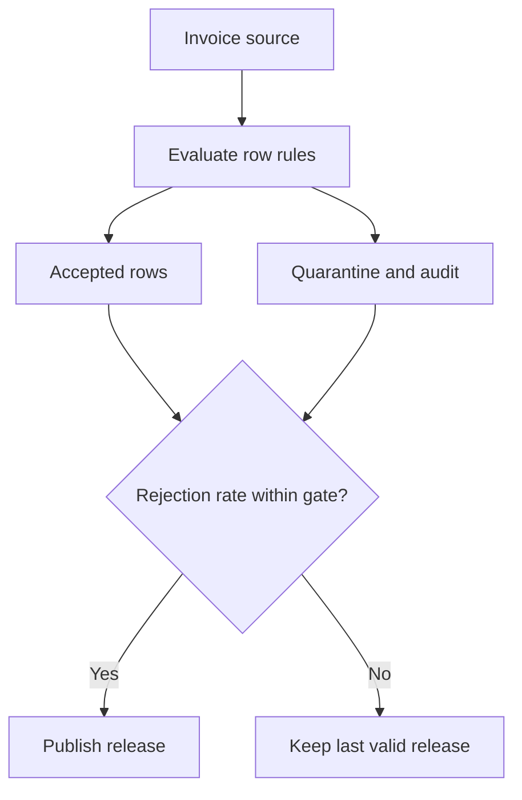
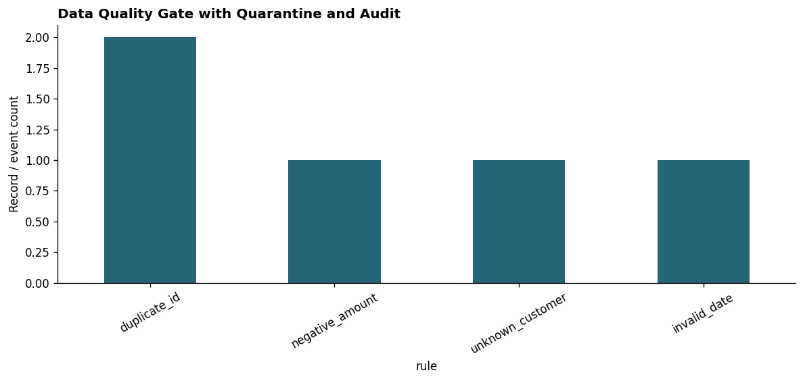
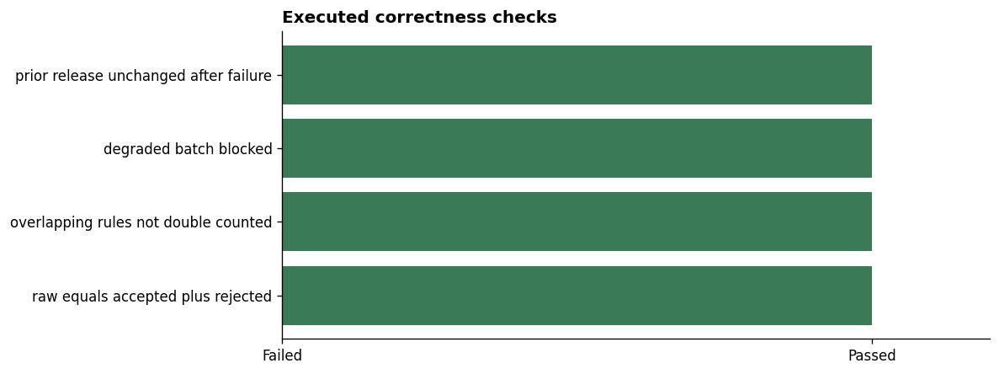

# Data Quality Gate with Quarantine and Audit

Implement auditable row rules, a rejection threshold and a blocking publication gate.

## Overview

A billing pipeline needs to prevent malformed or duplicated invoices from reaching its published dataset. This intermediate case study implements a local Data Engineering pipeline with included fixtures, persistent output artifacts, SQL verification and a notebook with saved execution outputs.

**Author:** Tajamul Khan. **Data:** Original synthetic fixtures. **Runtime:** Python and SQLite on one machine.

## Problem statement

- **Task:** Implement auditable row rules, a rejection threshold and a blocking publication gate.
- **Engineering skills:** Data contracts · quarantine · release gate · audit.
- **Success criterion:** Correct output plus passing failure, replay or integrity assertions, rather than an unmeasured throughput target.
- **Execution scope:** Runnable local implementation. Cloud/distributed platforms are extension targets and were not deployed for these results.

## STAR case study

### Situation

A billing pipeline needs to prevent malformed or duplicated invoices from reaching its published dataset.

### Task

Implement auditable row rules, a rejection threshold and a blocking publication gate.

### Action

Track all failed rules per row, quarantine bad rows, reconcile unique rejected rows and block a deliberately degraded batch. The implementation records output metrics, runs explicit correctness checks and exports evidence for inspection.

### Result

Published 296 accepted rows and quarantined 5 rows. A degraded batch breached the 2% gate and did not replace the last valid release.

All 4 listed engineering checks passed on the included fixtures. These are verified local test outcomes, not evidence of production scale, cost savings or business impact.

## Architecture



The diagram is also available as [`architecture.mmd`](architecture.mmd).

## Dataset

**Source:** Original synthetic data generated by [`generate_data.py`](generate_data.py), seed `202706`. No live API or external dataset is required. Included datasets are CC0-1.0; code and documentation are MIT licensed.

One raw invoice row includes invoice_id, customer_id, amount_cents and invoice_date. Duplicate invoice IDs invalidate all matching rows; rule counts can overlap.

- [`data/invoices.csv`](data/invoices.csv)

See [`data/README.md`](data/README.md) for field types, sample values and deliberate edge cases. Fixtures describe a fictional 2025 scenario.

## Project workflow

1. Inspect source fixtures, grain and SHA-256 hashes in the notebook.
2. Run the pipeline implementation from a fresh local demonstration state.
3. Exercise the documented failure, replay or integrity scenarios.
4. Query the generated SQLite artifact using checked-in SQL.
5. Reconcile SQL counts with the pipeline evidence.
6. Export tables, charts, a validation report and an offline operational dashboard.

## Engineering decisions

Duplicate keys invalidate all duplicate rows. Rule failure totals can overlap, so rejected-row count is calculated with a row-wise OR. The fixture uses a 2% rejection ceiling; that threshold is a teaching choice, not a universal quality standard.

## Executed correctness checks

Inject duplicate, invalid amount, unknown customer and invalid date records; deliberately degrade a second batch and verify the previous publication survives.

| Check | Result |
|---|---|
| raw equals accepted plus rejected | Passed |
| overlapping rules not double counted | Passed |
| degraded batch blocked | Passed |
| prior release unchanged after failure | Passed |

The assertions run inside the pipeline and notebook. A failed assertion stops execution. [`outputs/checks.json`](outputs/checks.json) and [`outputs/validation_results.csv`](outputs/validation_results.csv) contain the recorded results.

## Verified results

| Metric | Executed value |
|---|---:|
| Raw invoices | 301.0000 |
| Accepted invoices | 296.0000 |
| Rejected rows | 5.0000 |
| Rejected rate (%) | 1.6611 |
| Degraded batch rejected rows | 101.0000 |





## Files and outputs

| File | Purpose |
|---|---|
| [`pipeline.ipynb`](pipeline.ipynb) | Full implementation, executed code, rendered tables and two saved charts |
| [`pipeline.py`](pipeline.py) | Standalone pipeline implementation with assertions |
| [`generate_data.py`](generate_data.py) | Reproducible fixture generator |
| [`verification.sql`](verification.sql) | SQLite query over generated artifacts |
| [`outputs/quality.sqlite`](outputs/quality.sqlite) | Inspectable local database created by the pipeline |
| [`outputs/summary.csv`](outputs/summary.csv) | Pipeline output summary |
| [`outputs/sql_results.csv`](outputs/sql_results.csv) | Saved SQL verification output |
| [`outputs/metrics.json`](outputs/metrics.json) | Machine-readable run metrics |
| [`outputs/finding.txt`](outputs/finding.txt) | Measured result and interpretation |
| [`outputs/dashboard.html`](outputs/dashboard.html) | Offline operational dashboard |

Additional per-project artifacts include state tables, quarantines, manifests, partitioned files or task logs as applicable. See the `outputs/` directory.

## How to run

From the repository root:

```bash
python -m venv .venv
source .venv/bin/activate
# Windows PowerShell: .venv\Scripts\Activate.ps1
python -m pip install -r requirements.txt
cd data-engineering/07-data-quality-gate
python -m jupyterlab pipeline.ipynb
```

Run notebook cells from top to bottom. The code cell contains the implementation itself, not just a call to an invisible package.

To rebuild pipeline tables and verification evidence without opening Jupyter:

```bash
python pipeline.py
```

The script rebuilds local demonstration state. It exercises replay/recovery internally; it is not a long-running production daemon. Execute the notebook to also regenerate charts and the HTML dashboard.

To regenerate source data:

```bash
python generate_data.py
```

To execute all ten engineering notebooks and verify their saved outputs, from the repository root:

```bash
python scripts/execute_all.py data-engineering
python scripts/verify_data_engineering.py
```

## Inspect the dashboard

Download or clone the repository and open `outputs/dashboard.html` in a browser. It is a self-contained HTML file with no external JavaScript or paid service dependency. Cards and charts are a completed-run snapshot. The filter searches summary rows only and does not recompute metrics.

GitHub renders notebook outputs but does not execute HTML dashboards in the file browser. This project does not include a PBIX or Tableau workbook.

## Operating runbook

- **Before a run:** Use the included fixtures or review the contract before replacing them. Back up any outputs you want to keep; these examples deliberately rebuild local demonstration state.
- **If an assertion fails:** Inspect the source, `verification.sql` and the failed rule. Correct the cause before rerunning; do not remove an integrity check to make the run appear successful.
- **Recovery scenario:** Inject duplicate, invalid amount, unknown customer and invalid date records; deliberately degrade a second batch and verify the previous publication survives.
- **After a successful run:** Compare `metrics.json`, the SQL output and the validation report. Keep all outputs with the source version used to create them.
- **Before production:** Move the contracts into your quality framework, version expectations, alert on failed publication and test exception approvals.

## Limitations

Rules use a fixed synthetic customer allowlist and a simple date parser. This does not run Great Expectations, Airflow or an external alerting service.

No real infrastructure deployment, throughput benchmark, latency SLA or dollar savings is claimed. The included failure probes validate the stated local contracts only.

## Career and interview preparation

### Resume bullet

“Built a data quality gate with quarantine and audit portfolio project using Python and SQLite, implemented 4 verified correctness checks and documented reproducible output evidence.”

Use only after reproducing the work and understanding the design. Replace generic wording with the specific engineering contract you can explain; describe the synthetic/local scope honestly.

### 60-second STAR answer

“In this simulated scenario, a billing pipeline needs to prevent malformed or duplicated invoices from reaching its published dataset. My task was to implement auditable row rules, a rejection threshold and a blocking publication gate. I implemented the pipeline and exercised its failure and integrity boundaries. Published 296 accepted rows and quarantined 5 rows. A degraded batch breached the 2% gate and did not replace the last valid release. The next production step would be to move the contracts into your quality framework, version expectations, alert on failed publication and test exception approvals.”

### Questions to prepare

- What is the source grain and which key defines a duplicate or version?
- Which state survives a restart and when is it committed?
- Which failure does the test inject and what invariant must remain true?
- What changes when the source is live, data arrives late or two workers run concurrently?
- What exactly was measured here and what would require a production benchmark?

## Technologies

Python, Pandas, NumPy, SQLite, Matplotlib, IPython/Jupyter and offline HTML. Architecture diagrams use Mermaid.

## Author

**Tajamul Khan**

[GitHub](https://github.com/tajamulkhann) · [LinkedIn](https://www.linkedin.com/in/tajamulkhann/) · [Instagram](https://www.instagram.com/tajamul.codes/) · [Mentorship](https://topmate.io/tajamulkhan)

## Let's Connect

<div align="center">
<a href="https://www.linkedin.com/in/tajamulkhann/"></a>
<a href="https://www.instagram.com/tajamul.codes/"></a>
<a href="https://topmate.io/tajamulkhan"></a>
<a href="https://www.whatsapp.com/channel/0029VaYs05jJkK7JKCesw42f"></a>
<a href="https://t.me/tajamul_khan"></a>
<a href="https://substack.com/@tajamulkhan"></a>
<a href="https://www.kaggle.com/tajamulkhan"></a>
<a href="https://github.com/tajamulkhann"></a>
<a href="https://medium.com/@tajamulkhan"></a>
</div>

